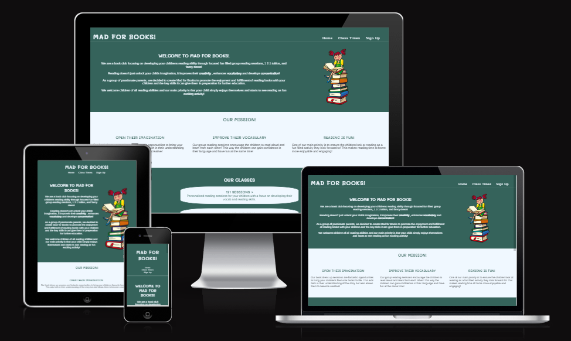
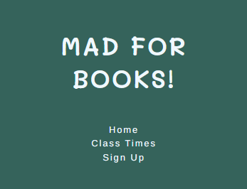
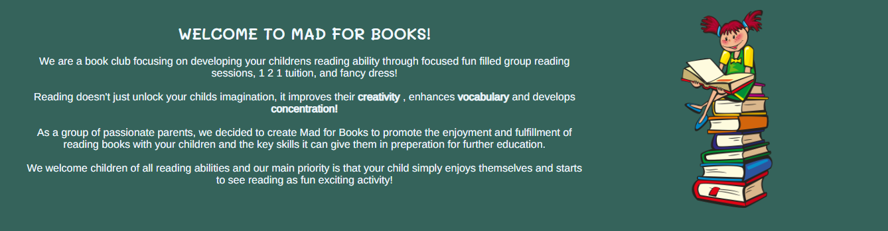
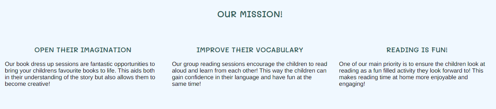
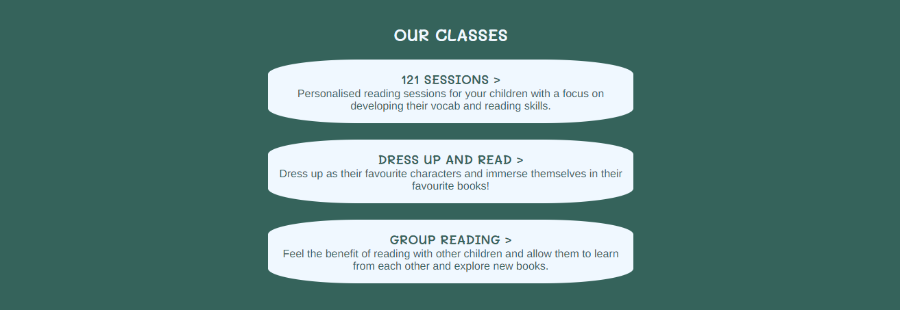
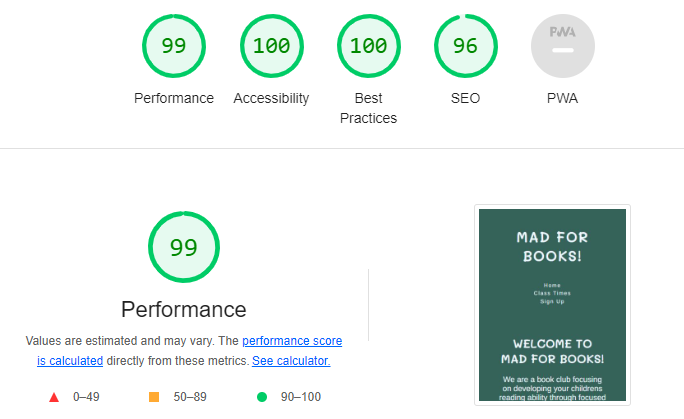

# MAD FOR BOOKS! 

Mad for Books is a site that encourages parents/guardians to involve their children in our book club, and take advantage of the different classes that aim to encourage children to see reading as a fun and exciting enterprise, rather than a reluctant acitivty. The site is very informative and simplistic in its design, it aims to gives busy parents, all the information they need in a quick and coherent manner without too much complexity. 

### Author 

James Gardner

### Target Audience

- Due to the age range for the book clubs being aimed at pre school (under 5 years old), the site is very much targeted towards parents and guardians of children who are looking for extra carricular activity, or as a social club where their children can interact with other children and connect through reading.

## Features 

### Navigation Bar

- Featured on all three pages throughout the site. The navigation bar has links to the Homepage, Book Club Times and Sign Up pages.
- The nav bar design has been kept the same throughout all pages on the site to allow for easy and repetitive navigation
- It follows a simple layout that feeds in with the feel of the rest of the site with an easy to read font size and clear and concise page headings.
- The navbar changes design at 825px screen width and 375px screen width.

### Welcome To Section 

- The Welcome To section is our opportunity to summarise what we are about as a book club. 
- The Sub Heading repeats our name and follows the same font styling as the header with slightly minimised text.
- The content in this section aims to be informative but also direct and straight to the point. We list our different classes in the first sentence and follow this up with some key benefits we believe our club can give children.
- The second half of content describes our motivations and what we aim to achieve through the children using our book clubs and the content finishes with some useful generic information visitors of the site would expect.
- The image chosen feeds in with the simplistic nature of the site but also adds an eye catching combination of different colours, it also plays out the objective of the site which is to engage children with books and reading. 
- The image is hidden at max width 475px.

### Our Mission 

- This section gives visitors to the site more understanding of our motivations and gives Mad for Books an identity.
- The demographic this site is aimed at are potentially entrusting us to further their childrens education through further reading, so this section is about selling our aims for their children and what we focus on to ensure the development and enjoyment is present.
- Again, the content is compact, informative and based around features and benefits.

### Our Classes

- The bottom of the homepage feeds into the next natural place a visitor will go on the site and gives a summary of the classes we offer as a book club.
- The classes are titled to give an understanding of what the class entails through its name, however this section aims to expand and answer any potential questions.
- As mentioned above, this site is very much an introduction to the book club and an attempt to engage more parents and get their kids signed up, so while this section could have alot more content in terms of the make up of each class, this would not feed into the simplistic nature of the site. 

### The Footer

- The footer has useful links to our social media > Facebook, Twitter and Instagram. Upon clicking each one will open in a new tab.
- The colour scheme stays in touch with the site and this follows the same design throughout the entire site, just like the header. 

### Class Times 

- The Class Times gives a visitor to the site exactly what they want > a simply designed table with easy to read content that gives them the information they require.
- The table lists all the vital information a visitor to the site will need including, time, location, the duration of the class, what the activity is and also how many children that specific class is for.
- There is also clear instructions on how to get more information and sign your child up for the classes within the table at the bottom of the page.
- A scroll bar comes into effect at max width 470px as the table become distorted and unreadable and i felt this gave the best user experience at that screen size.
- I think it was important both on this page, and our sign up page, to keep the design the same in terms of pallete and feel, but be very direct with the information. 

### Sign Up Page

- This page allows the user to send in all their relevant information to Mad for Books with the aim of us then contacting the user to formally sign their children upo and ge tthem booked in for classes
- The sign up page covers all the key information expected with all the fields being required or the form unable to be submitted
- The user can also select which class interests them the most from the drop down bar where they are also able to select "not sure" should they have no preference at this time.

### Features to Implement

- A "Thank you" page for signing up and sending the user details over, with further information on next steps for the user.

## Testing

### Validator Testing 

### HTML Validation 

- Index.html validation 

- bookclubtimes.html validation 

- signup.html validation

### CSS Validation

- style.css

- Accessibility  
    - I confirmed the colors and fonts chosen for the site are easy to read and accessible by running the site through lightouse in devtools.

## Compatibility and Responsive Testing

- I have ensured my site works well both aesthetically and functionally on a variety of devices and browsers as noted in my table below:

| Tool/Device                   | Browser       | OS          | Screen Width |
|-------------------------------|---------------|-------------|--------------|
| Devtools Emulator Galaxy Fold | Chrome 108    | Windows 10  | 280 x 653    |
| Real Phone iPhone 12          | Safari 15.6.1 | iOS16       | 390 x 844    |
| Real Phone iPhone SE          | Safari 15.6.1 | iOS16       | 375 x 667    |
| Devtools Emulator Pixel 5     | Chrome 108    | Windows 10  | 393 x 851    |
| Devtools Emulator iPad Air    | Chrome 108    | Windows 10  | 820 x 1180   |
| Real Asus E210 Laptop         | Firefox 88    | Windows 10  | 768 x 1366   |
| Real Tablet Amazon Fire 10 HD | Silk          | Fire OS 7.1 | 1200 x 1920  |

### Manual Testing- 

- I have confirmed all links navigate to correct locations and work well, they are readable and easy to understand.
- I have confirmed the form works with the fields required needed before submitting highlighted in the screengrab below.

- Once submitted the form goes through to code institute data dump page in new tab 
- Looks good on mobile, tablet, laptop and desktop.

### Unfixed Bugs 

- The logo and navigation menu are very slightly off center under 825px screen width. This is aesthetically very difficult to see for the user and has no impact on the core functionality of the site.

## Deployment 

The site was deployed to GitHub pages. The steps to deploy are as follows:

- In the GitHub repository, navigate to the Settings tab
- On the left hand taskbar, find the tab "pages"
- Find the source section and select the drop down bar option "Deploy from a branch"
- Save the branch and the page will refresh with the link to the live site

The live link to the site can be found here - [Mad For Books Live Site](https://jimgardner0204.github.io/Mad-For-Books/)

## Credits 

Below I have listed and assigned the content used within the website 

### Content

- The social media icons on the footer were taken from [Font Awesome](https://fontawesome.com/)
- The coding for the flex responsive design was learnt from Tania Rascia on [Codepen](https://codepen.io/)

### Media

- - The image used on the homepage was taken from [Pixabay](https://pixabay.com/)

## Acknowledgements 

- I would like to acknowledge the input from my code institute mentor Malia Havlicek on her expert guidance and input into this project.
- I have taken key learnings from the Code Institute Love Running Project as well as the website [codepen](https://codepen.io/) and especially the developer Tania Rascia who explained and created code for flex grids.
- I have used the site [W3 Schools](https://www.w3schools.com/) that has provided me with great examples and clarification code for this project.

[def]: /../main/assets/images/AmIResponsive.png